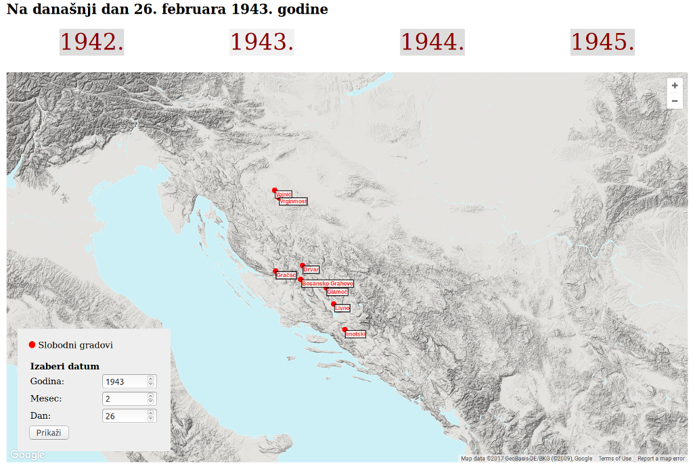

[](http://znaci.net/arhiv/)

# Arhiv Znaci

Baza dokumenata o drugom svetskom ratu na tlu Jugoslavije. Sadrži na stotine hiljada unosa.

Naslovna stranica prikazuje mapu oslobođenih gradova u okupiranoj Jugoslaviji na današnji dan.

Poseti: [znaci.net/arhiv](http://znaci.net/arhiv/)

## Razvoj

- Prekopiraj bazu `znaci` na lokalni mysql server
- Iskljuci strogi SQL mod, jer pucaju upiti bez podrazumevanih vrednosti
  - Proveri jel uključen: `SHOW VARIABLES LIKE 'sql_mode';`
  - Ako jeste isključi: `SET GLOBAL sql_mode='';`
- Prekopiraj sa produkcije fajlove `ukljuci/povezivanje2.php` i `ukljuci/povezivanje-staro.php` i unesi podatke za povezivanje sa lokalnom bazom
- Podesi naziv podomena u fajlu `ukljuci/config.php`
- Podesi naziv podomena u fajlu `js/main.js`
- Instaliraj i omogući mode rewrite za apache server (negde je omogućeno po defaultu)
- Pokreni projekat preko lokalnog servera

### Menjanje CSS-a

Build proces za `CSS` se pokreće komandom:
```
npm install
npm start
```

CSS se potom edituje u `css/dev` folderu, i automatski se kompajlira (spajanje, minifikacija, autoprefiksi) u `css/dist`.

Ne možete editovati CSS direktno u `css/dist/style.css` fajlu.

### Pravljenje sličica

Za masovno pravljenje malih sličica (thumbnails), pokrenuti skriptu `admin/prevelicaj-slike.php` iz konzole.

Skripta smanjuje sve slike iz foldera `znaci.net/images` na visinu 200px i izvozi ih u `slike/smanjene`.

## TODO

- pdf frejm ne radi na firefoxu

- kada pravi novu odrednicu da odmah pravi slug
- srediti dinamičke naslove
- azurira opis, datum, oblast i pripadnost prebaciti iz ukljuci u api
- odvojiti iste elemente sa index.php i odrednica.php
- obrisati keširanje
- dodati odrednice (teme) u galeriju


```sql
SELECT id, REPLACE(REPLACE(REPLACE(REPLACE(REPLACE(REPLACE(REPLACE(REPLACE(REPLACE(REPLACE(REPLACE(REPLACE(REPLACE(LOWER(TRIM(naziv)), ' ', '-'), 'ž', 'z'), 'ć', 'c'), '&#268;', 'c'), 'ö', 'o'), 'đ', 'dj'), 'č', 'c'), 'š', 's'), '.', ''), '"', ''), ':', ''), '(', ''), ')', '')
FROM entia

UPDATE entia
SET slug = REPLACE(REPLACE(REPLACE(REPLACE(REPLACE(REPLACE(REPLACE(REPLACE(REPLACE(REPLACE(REPLACE(REPLACE(REPLACE(LOWER(TRIM(naziv)), ' ', '-'), 'ž', 'z'), 'ć', 'c'), '&#268;', 'c'), 'ö', 'o'), 'đ', 'dj'), 'č', 'c'), 'š', 's'), '.', ''), '"', ''), ':', ''), '(', ''), ')', '')
```
